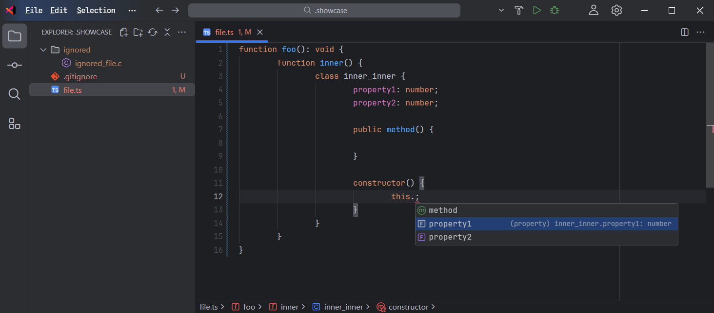
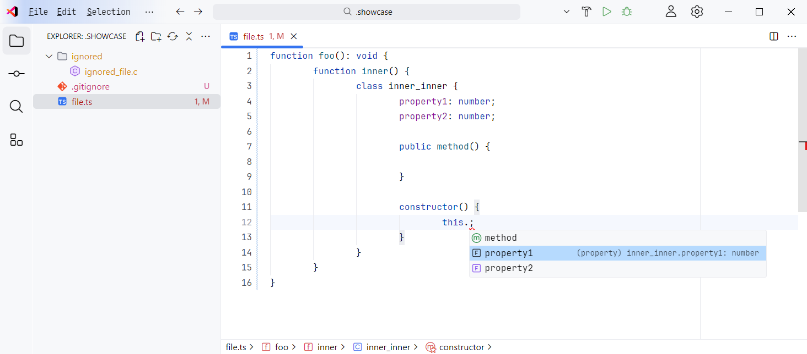

# Infos

Changes the settings and the look of `vscode` to emulate the one from Jetbrains IDEs.

## Jetbrains Mono font

The extension will automatically select `Jetbrains Mono Regular` as the editor
font if installed on the computer. You can download it [here](https://www.jetbrains.com/lpmono/).

## Custom CSS and JS

This depends on `be5invis.vscode-custom-css`. This means that every time vs code is updated, the
action `Reload Custom CSS and JS` must be run.

# Previews

